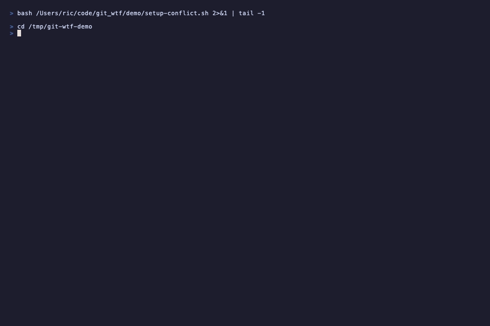

# git-wtf

Both branches were doing something specific. `git wtf merge` reads what each was trying to do, keeps both, and explains every change before writing a single file.

<p align="center">
  
</p>

---

## install

**macOS**

```bash
brew install git-wtf/tap/git-wtf
```

**Any OS**

```bash
pipx install git-wtf
```

First time using pipx? Run `pipx ensurepath` and restart your terminal. Git picks up `git-wtf` automatically as a subcommand, no aliases required.

Then configure your LLM provider (30 seconds):

```bash
git wtf setup
```

> API keys, proxy config, env vars: [SETUP.md](SETUP.md)

Don't have a merge conflict handy? Run `git wtf --demo`.

---

## what it does

### `git wtf merge`

When two branches both modified the same code, git sees a text conflict. `git wtf merge` goes deeper. It reads the commit history on each side, extracts all three blob versions of every conflicted file, and asks the LLM what each branch was actually trying to accomplish.

Then it writes a resolution that keeps both features intact.

Before touching disk it shows you:

- **Per-file panels** with a confidence rating (HIGH / MEDIUM / LOW) and a callout for anything it wasn't sure about
- **A plain-English summary** of what the app will do after this merge and what trade-offs were made
- **One prompt**: `apply this merge? [Y/n]`

Nothing is written until you say Y.

### `git wtf`

Diagnoses whatever state your repo is in: detached HEAD, mid-merge, diverged from remote, unresolved conflicts. Reads the git state, figures out what happened, tells you exactly what to run.

---

## how it works

- Parses conflict markers and extracts all three blob versions (ancestor, yours, theirs) with full file context
- Reads project context (`README.md`, `package.json`, `CLAUDE.md`, `.cursorrules`) so the LLM knows what you're building
- One LLM call per conflicted file, sent with both branches' full commit histories
- A second call writes a plain-English summary of what the merge will do
- Shows everything, asks once, then writes and stages the files

---

## what it doesn't do (yet)

- Rebase conflict resolution
- Multi-file semantic understanding (e.g. a type changed in one file and needs updating in five others)
- Auto-commit after merge

---

## license

MIT
license

MIT
